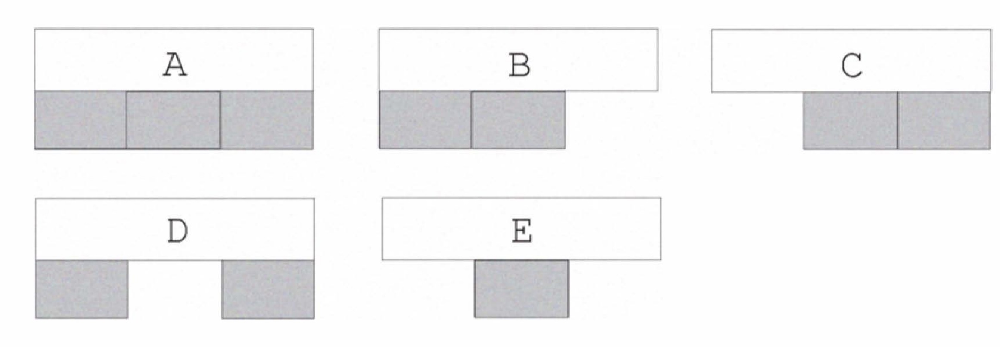
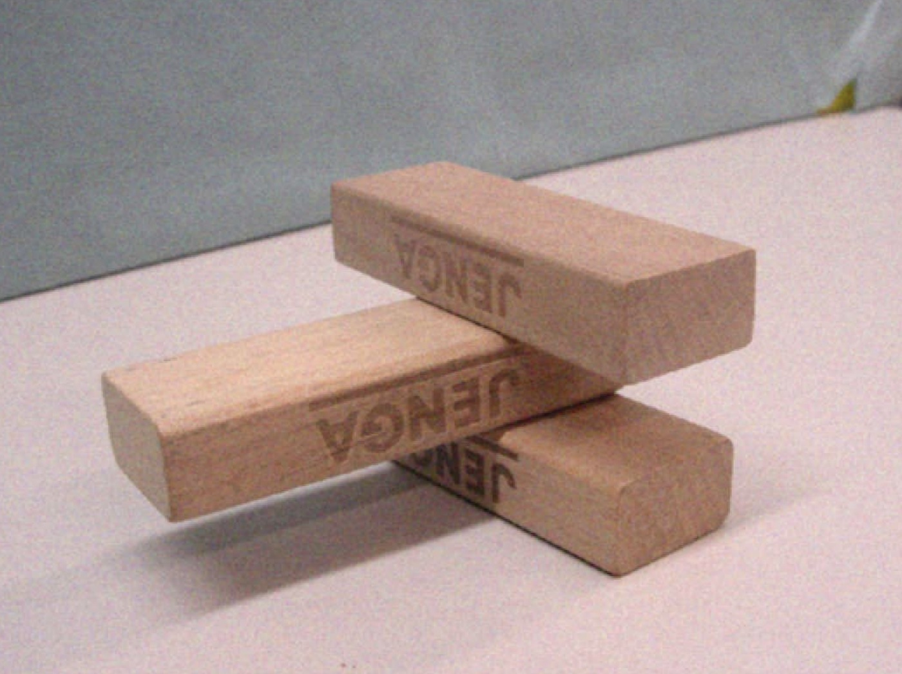
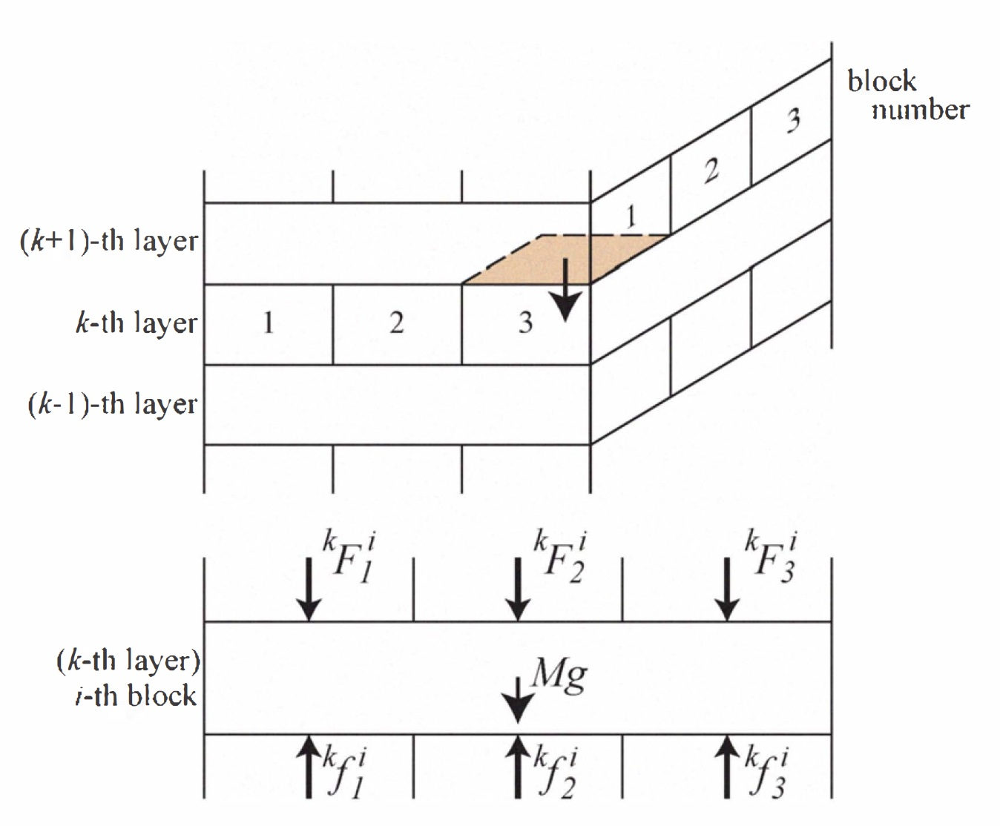
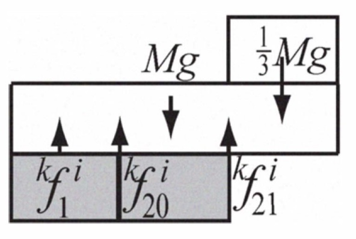
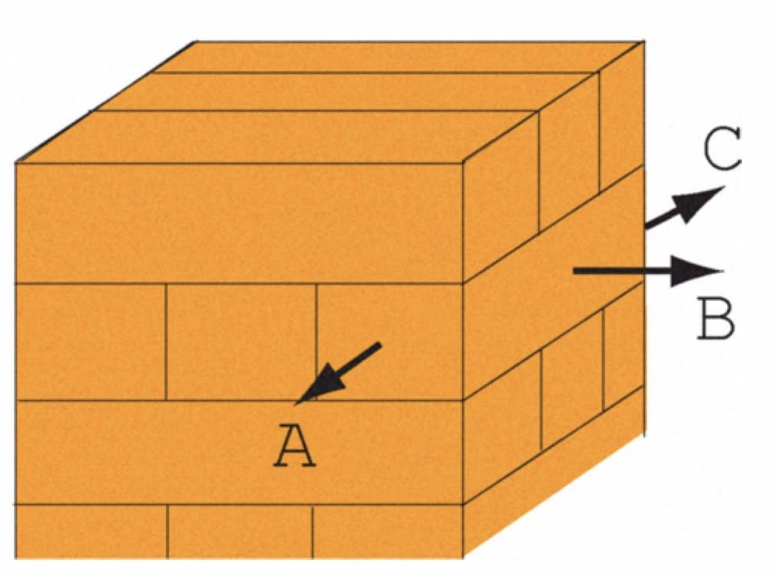
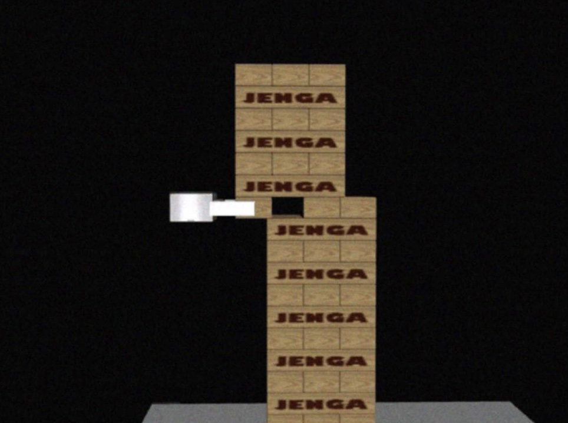
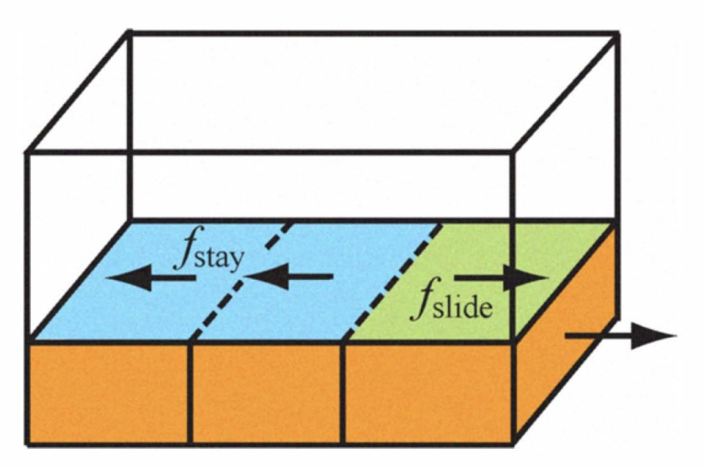
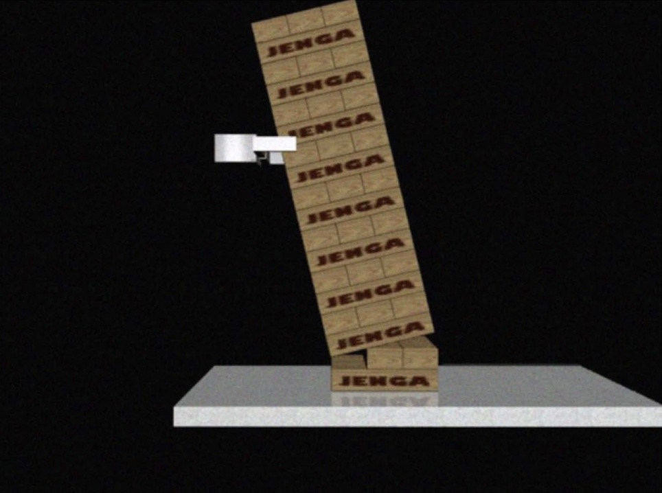
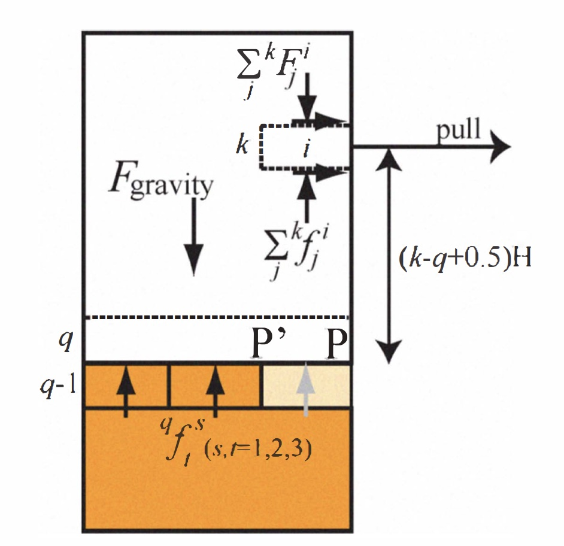

# 09 - Tower Dynamics

## Stable Patterns
First, we checked a model of stacked blocks. We pay attention to stability of one layer of block tower and its support by the lower layer. Combinations of the lower layer must be one of the five patterns in Fig. 2. In the view point of simple status of multiple blocks, Fig. 3 is also stable. But, according to Jenga game rule, it cannot be achieved. Before building this pattern the tower must be broken. So, here, we make a kinematics model of these five patterns with forces from upper layer and calculate acting force to the layer. 

    

    

## Kinematics of Each Layer
To calculate acting force to all blocks, we start its analysis from top layer to lower layers step by step.

First, we set some assumptions. As modeling of ideal state of block tower, we consider that all blocks have same size ($W \times W /3 \times H$), mass ($M$) and coefficient of friction ($\mu$),
which are all known. As preliminary experiments, we check mass and coefficient of friction for 4 sets of commercial Jenga block. The variation of the parameters between different sets is relatively large, however the variation between blocks in same set is relatively small. So we think it can be considered that these parameters are same in the same set. We also assume that the center of gravity of each block locates at the center of the block.

    

Now, we analyses forces acted on one block in $k$-th layer. We set that a model of acting force between upper and lower layers is located on the center of contact face. as shown in Fig. 4. For balance of the block,

$$
\begin{align}
    {}^{k}F_{1}^{i} + {}^{k}F_{2}^{i} + {}^{k}F_{3}^{i} + Mg &= {}^{k}f_{1}^{i} + {}^{k}f_{2}^{i} + {}^{k}f_{3}^{i} \\
    {}^{k}F_{1}^{i} - {}^{k}F_{3}^{i} - {}^{k}f_{1}^{i} + {}^{k}f_{3}^{i} &= 0 \\
    {}^{k}f_{1}^{i} &\geq 0 \\
    {}^{k}f_{2}^{i} &\geq 0 \\
    {}^{k}f_{3}^{i} &\geq 0.
\end{align}
$$

If there are no blocks $j$ in the upper or lower layers, ${}^{k}F_{j} = 0$ or ${}^{k}f_{j} = 0$. ${}^{k}F_{j}$ are known since the upper layer is already analyzed. So, we should analyze ${}^{k}f_{j}$ from the above equations. If there exist solutions $f_{j}^{i}$, this block is stable. However, in cases such as Fig. 5, the above model cannot reply stable solutions. In such cases, we divide acting force from the center lower block as shown in Fig. 5. Two forces ${}^{k}f_{20}$ and ${}^{k}f_{21}$ are acted on the both edge of the contact face. These cases may occur to pattern B, C and E in Fig. 2. So, first we analyze with the $f_2$ model. If it is not stable, we analyze again with $f_{20}$ & $f_{21}$ model. If it replies a stable
solutions, the block is stable. 

    

There exist another condition to be considered. Eq. (I) has
two conditions. But in pattern A and pattern B and C with $f_{20}$
& $f_{21}$ model, there are three forces. These are indeterminate
cases. So here, we define ${}^{k}f_{j}^{j}$ as that stress of each contact
face is close to each other. 

With these models, ${}^{k}f_{j}^{i}$, acting force between the layer in
attention and the lower layer can be calculated. When we
pay attention to the next $(k - 1)$-th layer, we set

$$
    {}^{k-1}F_{i}^{j} = {}^{k}f_{i}^{j}.
$$

When we use $f_{20}$ & $f^{21}$ model,

$$
    {}^{k-1}F_{i}^{2} = {}^{k}f_{20}^{j} + {}^{k}f_{21}^{j}.
$$

From this process, we can obtain the all force acting on
the whole block tower.

## Kinematics of Removing Blocks

### Block Removal Candidates

First of all, when we consider a block to remove, the tower
must be stable after the block is removed. It means that the
tower without the attention block must be stable. But, even
if the tower after removing is stable, there is a case that
the tower falls to pieces during removing the block. This
is caused by friction force. It acts to move other blocks
together. So in this section, we define margins of stable
during removing operation. With these margins, removing
block will be determined.

When a robot removes a side block, direction to remove
can be considered as 3 direction as shown in Fig. 6. Removing to A and C 
direction occur moment to rotate the tower
blocks. Under static friction condition, an object is easier
to rotate than to slide. So, this situation should be avoided.
Then in this process, we set that a robot remove a side block
to B direction. 

    

When removing a center block, a robot choses from
direction A and C by stability of the tower with the margins. 

### Upper Block Margin

When a robot tries to remove a block, there is some cases
that other upper blocks are also pulled by friction from the
target block as shown in Fig. 7. 

    

We define upper block stability margin fumargin as gap
between fslide, maximum static friction force between removing block and upper blocks and fstay, maximum static friction force between other block in the same layer and
upper blocks; $fumargin = f_{stay} - f_{slide}$. It should be
$f_{umargin} > 0$ and when $f_{umargin}$ becomes large, the upper
blocks are hard to be pulled by the removing block. If
$f_{umargin} < 0$, the upper blocks will be pulled with the 
removing block. So, to avoid such cases as Fig. 7, a robot
should select a block which has large margin $f_{umargin}$. 

While removing block i in k-th layer, acting force on upper
blocks are as Fig. 8. fslide, fstay are as Eq. (3) and (4). 

    

So the upper block stability margin of block i in k-th layer
is defined as

### Lower Block Margin

Another case of failure during removing block is as Fig. 9.
The tower tilts and is broken at the lower block under the
removing block.

    

    

To avoid this case, we define lower block stability margin.
Here we regard blocks to tilt as one body. This body
will brake and tilt at lower edge of a certain layer (q-th
layer). In this case, minimum force to tilt this body at kth layer is calculated as fJall' The maximum friction force between grasped block and the rest body is as fpull. With
these forces, the lower block stability margin is defined as
fl�argin
= fJall-fpull. It should be fl�argin > 0 and when
fl�argin becomes large, the body is hard to tilt and break.
If fl�argin < 0, the lower body will tilt and break at q-th
layer. So, to avoid such cases as Fig. 9, a robot should select
a block which has large margin for all q = 1" .. ,k - 1. 

    

Rotation center of block body at q-th layer is differ if there
exists a block in (q -1 )-th layer as shown in Fig. 10. If there
is a side block, rotation center may be P. In the other case,
P' will be rotation center, To obtain moment around P or P'
by gravity force, mass and position of center of gravity of
the body is required but they are not obvious. Then, we use
other force which is balanced with the gravitational moment.
It is a set of contact forces between (q -1) -th and q-th layers.
When the block body tilts at q-th layer by pulling a block
i in k-th layer, we set d�:� t ,
as a distance between rotation
center P or P' and every contact force q ff. 

So the lower block stability margin of block i in k-th layer
is defined as 

